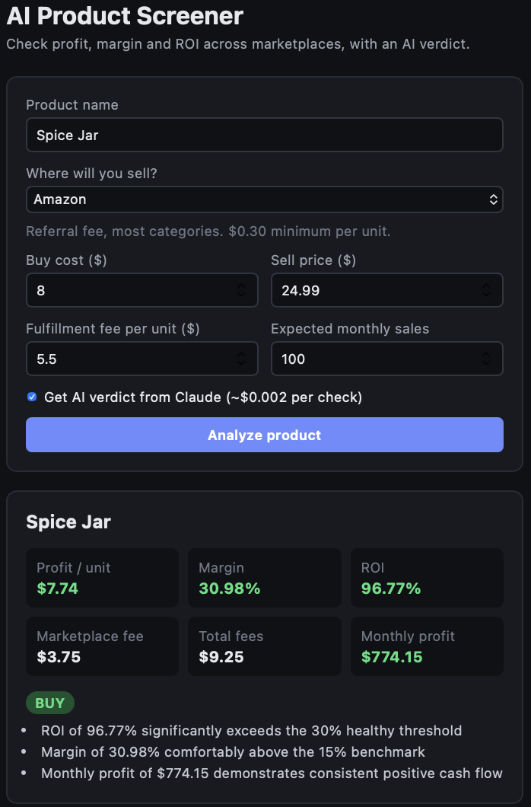

# AI Product Screener

A full-stack web app that tells you whether a product is worth reselling online.
Pick a marketplace (Amazon, Walmart, eBay, Etsy or TikTok Shop), enter your costs,
and get profit, margin and ROI after marketplace fees, plus an AI verdict
(**BUY / MAYBE / SKIP**) from Claude.

**Live demo:** https://ai-product-screener.vercel.app

> The backend runs on a free server that sleeps when idle, so the first request may take up to a minute.



## Why I built it

I resell products on online marketplaces and used to check every product's
numbers by hand. This tool automates the fee math for each platform and adds
a quick AI second opinion before I commit money to inventory.

## Features

- Marketplace-specific fee calculation for 5 platforms (percentage, fixed and minimum fees)
- Profit per unit, margin, ROI and monthly profit
- Optional AI verdict from Claude with short reasons
- Input validation on the backend (negative prices are rejected)
- Custom fee override for categories with non-standard rates

## Tech stack

| Layer | Tools |
|---|---|
| Frontend | React, Vite, CSS |
| Backend | Python, FastAPI, Pydantic |
| AI | Anthropic Claude API (Haiku 4.5) |
| Tooling | Git, ESLint, python-dotenv |

## How it works

```
React form  ->  POST /analyze  ->  FastAPI  ->  fee + profit math
                                      |
                               Claude API (optional)
                                      |
React results  <-  JSON with numbers + BUY / MAYBE / SKIP verdict
```

## Run it locally

**Requirements:** Python 3.10+, Node.js 20+, an Anthropic API key.

### Backend

```bash
python3 -m venv venv
source venv/bin/activate
pip install -r requirements.txt
cp .env.example .env        # then add your ANTHROPIC_API_KEY
uvicorn main:app --reload
```

API docs: http://127.0.0.1:8000/docs

### Frontend

```bash
cd frontend
npm install
npm run dev
```

App: http://localhost:5173

## API

| Method | Endpoint | Description |
|---|---|---|
| GET | `/health` | Health check |
| GET | `/marketplaces` | Supported marketplaces and their fee schedules |
| POST | `/analyze` | Profit analysis, with an optional AI verdict (`use_ai: true`) |

## Limitations

- Fee rates are the standard US "most categories" rates (verified September 2026).
  Category-specific and tiered rates are not modeled yet; use `fee_percent_override` instead.
- The AI verdict is based only on the numbers you enter. It does not check real sales data.

## Roadmap

- [ ] Save analysis history in a database
- [ ] Unit tests for fee calculations
- [x] Deploy (Vercel + Render)
- [ ] Category-specific fee tables
